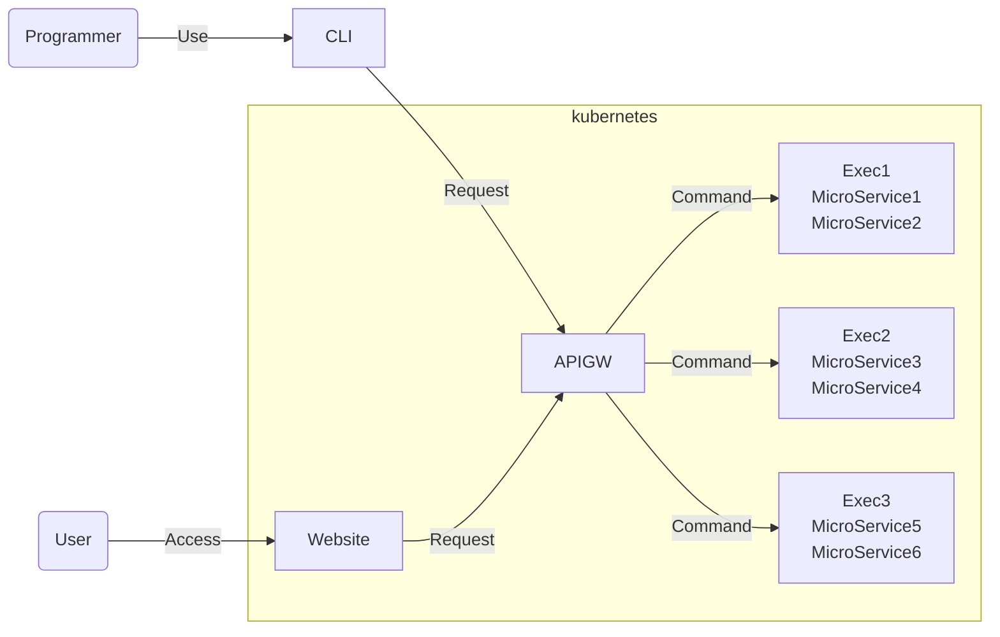

## EMS (Easy MicroService)

EMS is a platform where everybody can develop microservices.
Users can concentrate on developing their microservices.
Usually, EMS works on the k8s.



### How to use Website

https://user-images.githubusercontent.com/66401814/174425669-144c6855-36fd-4056-a647-f37b0da1dfa0.mov

### How to use CLI

https://user-images.githubusercontent.com/66401814/174425678-9b1c329d-4044-4348-8771-644e56ca4466.mov

## Contents

- [EMS (Easy MicroService)](#ems-easy-microservice)
  - [How to use Website](#how-to-use-website)
  - [How to use CLI](#how-to-use-cli)
- [Contents](#contents)
- [Let's Get started](#lets-get-started)
- [Why I created EMS](#why-i-created-ems)
- [Web Servers of EMS](#web-servers-of-ems)
- [website](#website)
  - [website REST API](#website-rest-api)
- [apigw](#apigw)
  - [apigw REST API](#apigw-rest-api)
- [exec](#exec)
  - [exec REST API](#exec-rest-api)
- [cli](#cli)
  - [How to use](#how-to-use)
- [Test](#test)
- [How to create microservices](#how-to-create-microservices)
- [How to register microservices to exec service.](#how-to-register-microservices-to-exec-service)

<br>

## Let's Get started

1. Installing

```commandline
git clone https://github.com/biki-cloud/webapi.git
```

<br>

2. Start EMS containers

```commandline
cd deployment/docker

./start_EMS.sh
Your IPAddress: 192.168.1.12 # IPAddress is dependent on your PC.

docker run -e LOCAL_APIGW_SERVERS=http://192.168.1.12:8001 -p 7001:80 --name website bikibiki/website:v1.0.8

docker run -p 8001:80 -e LOCAL_EXEC_SERVERS=http://192.168.1.12:9001 --name apigw bikibiki/apigw:v1.1.1

docker run -p 9001:80 -e DOWNLOAD_PORT=9001 -e MY_IP=192.168.1.12 --name exec bikibiki/exec-python:v1.0.20

Please access this URL: http://192.168.1.12:7001/user/top
```

<br>

3. Access URL on browser

<br>

4. Clean EMS container

```commandline
cd deployment/docker

./clean_EMS.sh
```

Done!

## Why I created EMS

The reason why I created EMS is that I want everybody to develop microservices easily.
Usually, when developing microservices, need to create the logic of communication of other services.
For example, it is like a REST API or GRPC or etc.

But It is not easy for a beginner who has been starting to learn to program.
So EMS provides the logic of connection between all microservices.
By doing that, Beginner can create microservices. even if it is a big service.
And They don't need to care about the logic of communication with other microservices.

## Web Servers of EMS

## website

website is a web application that users use registered microservices of EMS.

### website REST API

```go
func (app *Application) Routes() *http.ServeMux {
  router := http.NewServeMux()

  // This handler shows all programs to use.
  router.HandleFunc("/user/top", app.Top)

  // This handler executes microservices.
  router.HandleFunc("/user/exec/", app.Exec)

  // File server handler
  router.Handle("/static/", http.StripPrefix("/static/", http.FileServer(http.Dir(filepath.Join(currentDir, "ui/static")))))

  // This handler uses that determine this server is alive.
  router.HandleFunc("/health", pkgHttpHandlers.HealthHandler)

return router
}
```

## apigw

apigw works load balancing to exec service and manage registered microservices of exec service.

### apigw REST API

```go
package application

import (
  "net/http"

  pkgHttpHandlers "webapi/pkg/http/handlers"
)

func (app *Application) Routes() *http.ServeMux {
  router := http.NewServeMux()

  // Return exec server URL that uses lowest using memory.
  router.HandleFunc("/program-server/memory/minimum", app.GetMinimumMemoryServerHandler)

  // Return exec server URL that has program and uses lowest using program.
  router.HandleFunc("/program-server/minimumMemory-and-hasProgram/", app.GetMinimumMemoryAndHasProgram)

  // Return exec servers URL that is working in real time.
  router.HandleFunc("/program-server/alive", app.GetAliveServersHandler)

  // Get program info that all exec server has.
  // Return display it as JSON.
  router.HandleFunc("/program-server/program/all", app.GetAllProgramsHandler)

  // This handler uses that determine this server is alive.
  router.HandleFunc("/health", pkgHttpHandlers.HealthHandler)

  // This handler displays the status of the memory of this server as JSON.
  router.HandleFunc("/health/memory", pkgHttpHandlers.GetRuntimeHandler)

  return router
}
```

## exec

exec works registering created microservices and executing microservices.

### exec REST API

```go
package application

import (
  "net/http"

  pkgHttpHandlers "webapi/pkg/http/handlers"
)

func (app *Application) Routes() *http.ServeMux {
  r := http.NewServeMux()

  // This handler works as file server handler.
  fileServer := "/" + app.Cfg.FileServer.Dir + "/"
  r.Handle(fileServer, http.StripPrefix(fileServer, http.FileServer(http.Dir(app.Cfg.FileServer.Dir))))

  // This API that executes registered service.
  r.HandleFunc("/api/exec/", app.APIExec)

  // This API that uploads file.
  r.HandleFunc("/api/upload", app.APIUpload)

  // This handler displays the status of the memory of this server as JSON.
  r.HandleFunc("/health/memory", pkgHttpHandlers.GetRuntimeHandler)

  // This API displays the program which is registered on this server.
  r.HandleFunc("/program/all", app.AllHandler)

  // This handler uses that determine this server is alive.
  r.HandleFunc("/health", pkgHttpHandlers.HealthHandler)

  // This API works for downloading contents of the file server.
  r.HandleFunc("/download/", app.Download)

  return r
}
```

## cli

The user uses microservices that are registered EMS on the command line.

### How to use

```shell
# The simplest way to execute.
cli -name <program name> -i <input file> -o <output directory>

# If add some parameter, need to surround letters were after -p with a double quotation.
# The letters depend on the content of microservices.
cli -name <program name> -i <input file> -o <output directory> -p "<parameter1,parameter2>"

# In case that receives the result of executing with JSON.
cli -j -name <program name> -i <input file> -o <output directory>

# In case that executing while outputting a log.
cli -l -name <program name> -i <input file> -o <output directory>
```

## Test

```shell
go test ./...
```

## How to create microservices

1. Determine microservices that we want to create <br>
   Content of implement: We want to create microservices that take file, then output file that is added extension of ".json" to them.

<br>

2. Create project

```shell
mkdir ConvertToJson
cd ConvertToJson
touch convert_to_json.py
```

<br>

3. Determine command to execute

```shell
python3 convert_to_json.py <input file> <output dir>
```

<br>

4. Coding

```python
import os
import shutil
import sys

infile = sys.argv[1]
output_dir = sys.argv[2]

outfile = os.path.join(output_dir, os.path.basename(infile)) + ".json"
shutil.move(infile, outfile)
```

<br>

5. Write help about coded program

```shell
cat help.txt
take file, then output file that is added extension of ".json" to them
```

## How to register microservices to exec service.

1. Edit exec/config/programConfig.json

```json
{
  "programs": [
    {
      "name": "ConvertToJson",
      "command": "python3 programs/ConvertToJson/convert_to_json.py INPUTFILE OUTPUTDIR PARAMETA",
      "helpPath": "programs/ConvertToJson/help.txt"
    }
  ]
}
```

<br>

2. Move created project directory to exec/programs directory

```shell
mv ConvertToJson exec/programs/ConvertToJson
```
